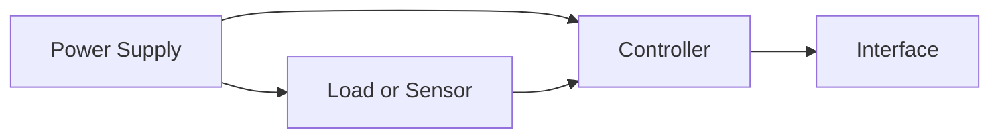

# System Architecture

## System Boundary

Which functions belong to the system and which do not?

## Block Diagram

## Interfaces

| Interface | Type | Direction | Voltage | Protocol |
| --------- | ---- | --------- | ------- | -------- |
| IF-001    | TBD  | TBD       | TBD     | TBD      |

## Main Components

| Component  | Function       | Selection status |
| ---------- | -------------- | ---------------- |
| Controller | System control | open             |

## Main Risks

| Risk                    | Impact        | Mitigation             |
| ----------------------- | ------------- | ---------------------- |
| Component not available | Project delay | Define a second source |
